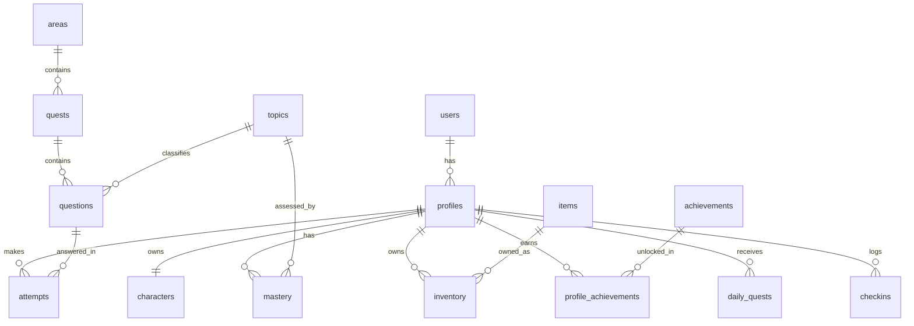

# PRD — Project Requirements Document

## 1. Overview

Questly adalah game edukasi Android untuk anak yang menggabungkan pengalaman bermain petualangan/RPG ringan dengan sistem belajar adaptif berbasis AI. Target pengguna utamanya adalah anak SD kelas 2 dan SMP kelas 3, dua kelompok usia dengan kemampuan yang sangat berbeda.

Masalah yang ingin diselesaikan:
- Anak mudah bosan dengan latihan soal biasa.
- Game edukasi di pasaran sering monoton dan tidak berubah-ubah, sehingga cepat ditinggalkan.
- Setiap anak punya kemampuan berbeda, tetapi sebagian besar game edukasi memakai soal yang sama untuk semua anak.

Tujuan utama Questly:
- Membuat anak belajar **tanpa merasa sedang belajar**. Anak asyik menyelesaikan misi, mengalahkan tantangan soal, mendapatkan XP, koin, item, membuka area baru, dan menaikkan level karakter.
- Menghadirkan **soal adaptif**: sistem mempelajari performa anak, lalu menyesuaikan materi, tingkat kesulitan, jenis soal, dan frekuensi latihan sesuai kemampuan masing-masing.
- Menggunakan AI untuk **membuat soal, pilihan jawaban, kunci jawaban, penjelasan, variasi soal, dan penyesuaian tingkat kesulitan**, tetapi AI tidak menentukan kurikulum secara bebas. Semua soal tetap mengikuti struktur kelas, mata pelajaran, topik, dan tingkat kesulitan yang sudah ditentukan sistem.

## 2. Requirements

Persyaratan utama proyek Questly:

1. **Aplikasi Android** yang menyenangkan dan mudah dipakai anak-anak, dengan tampilan warna-warni serta interaksi yang sederhana.
2. **Struktur kurikulum tetap** yang mencakup kelas, mata pelajaran, topik, dan tingkat kesulitan. AI hanya bekerja di dalam struktur ini dan tidak boleh membuat kurikulum sendiri.
3. **Sistem soal adaptif**:
   - Menganalisis jawaban benar/salah, waktu menjawab, dan pola kesalahan anak.
   - Menambah latihan pada topik yang masih lemah.
   - Mengurangi soal dasar dan menaikkan tantangan jika anak sudah menguasai materi.
4. **Variasi bentuk soal**, tidak hanya pilihan ganda:
   - Pilihan ganda
   - Input jawaban (mengetik jawaban)
   - Benar/Salah
   - Mencocokkan (matching)
   - Tarik dan lepas (drag and drop)
5. **AI generation** untuk:
   - Membuat soal
   - Membuat pilihan jawaban
   - Membuat kunci jawaban
   - Membuat penjelasan jawaban
   - Membuat variasi soal agar tidak repetitif
   - Menyesuaikan tingkat kesulitan
6. **Gameplay RPG**:
   - Karakter anak
   - Level dan XP
   - Dunia berisi beberapa area
   - Quest/misi di setiap area
   - Koin, item, dan kosmetik
   - Area baru yang terbuka sesuai progres
7. **Fitur keterlibatan harian**: misi harian, hadiah login, catatan kehadiran, achievement, dan papan peringkat.
8. **Akun dan pengaturan**: pendaftaran/masuk, profil anak, pengaturan suara, notifikasi, dan ukuran teks.
9. **Keamanan dan kenyamanan anak**: data anak tidak dibagikan sembarangan, dan orang tua dapat mengawasi aktivitas.

## 3. Core Features

### Fase 1 — Peta Petualangan

- **Lihat Peta Dunia** — Layar utama menampilkan peta dengan beberapa area petualangan yang tersedia untuk dijelajahi.
- **Pilih Area** — Anak mengetuk area untuk melihat daftar quest yang bisa dimainkan.
- **Buka Area Baru** — Area baru terbuka setelah anak menyelesaikan quest-quest sebelumnya.
- **Lihat Progress** — Anak bisa melihat seberapa banyak area dan quest yang sudah diselesaikan.

### Fase 2 — Misi Quest dan Progres Karakter

- **Misi Quest**
  - **Mulai Misi** — Anak membuka misi di area tertentu dan mengikuti alur cerita singkat.
  - **Tantangan Soal** — Soal muncul sebagai rintangan di dalam misi. Anak harus menjawab untuk melanjutkan cerita.
  - **Umpan Balik Jawaban** — Anak langsung melihat jawabannya benar atau salah, lengkap dengan penjelasan singkat.
  - **Hadiah Misi** — Setelah misi berhasil, anak mendapat XP, koin, dan item.
- **Progres Karakter**
  - **Naik Level** — Karakter naik level setiap kali XP mencukupi.
  - **Inventori Item** — Anak melihat dan memakai item/kosmetik miliknya.
  - **Ubah Penampilan** — Anak bisa mengganti tampilan karakter dengan item yang dimiliki.

### Fase 3 — Soal Adaptif, Hadiah Harian, dan Papan Prestasi

- **Soal Adaptif**
  - **Analisis Performa** — Sistem belajar dari jawaban anak untuk mengetahui kekuatan dan kelemahannya.
  - **Soal Disesuaikan** — Tingkat kesulitan, jenis soal, dan topik latihan berubah sesuai kemampuan anak.
  - **Variasi Bentuk Soal** — Anak mendapat soal dalam bentuk pilihan ganda, isian, mencocokkan, benar/salah, dan drag and drop.
  - **Materi Terstruktur** — Soal selalu mengikuti mata pelajaran, topik, dan kelas yang sudah ditentukan.
- **Hadiah Harian**
  - **Misi Harian** — Setiap hari muncul misi singkat yang bisa diselesaikan.
  - **Klaim Hadiah** — Anak mengambil hadiah login harian seperti koin dan item.
  - **Catatan Kehadiran** — Anak melihat berapa hari berturut-turut sudah aktif bermain.
- **Papan Prestasi**
  - **Daftar Achievement** — Anak membuka koleksi lencana yang didapat dari pencapaian.
  - **Papan Peringkat** — Anak melihat peringkatnya dibandingkan pemain lain.
  - **Notifikasi Penghargaan** — Muncul pemberitahuan saat anak memperoleh prestasi baru.

### Fase 4 — Akun dan Pengaturan

- **Daftar dan Masuk** — Anak atau orang tua membuat akun atau masuk ke akun yang sudah ada.
- **Profil Anak** — Anak mengisi nama, kelas, dan memilih karakter awal.
- **Pengaturan Aplikasi** — Mengatur suara, notifikasi, dan ukuran teks sesuai kenyamanan.

## 4. User Flow

Perjalanan pengguna dalam Questly:

1. **Membuat Akun dan Profil**
   - Anak/orang tua membuka aplikasi.
   - Daftar atau masuk ke akun.
   - Membuat profil: nama, kelas (SD 2 / SMP 3), dan memilih karakter awal.

2. **Melihat Peta Petualangan**
   - Setelah masuk, anak berada di layar peta dunia.
   - Anak melihat area terbuka dan area terkunci beserta progress-nya.

3. **Memilih Misi**
   - Anak mengetuk area terbuka.
   - Anak memilih salah satu quest di area tersebut.
   - Jika quest masih terkunci, sistem memberitahu misi apa yang harus diselesaikan lebih dulu.

4. **Menjalankan Misi**
   - Anak membaca alur cerita singkat pembuka misi.
   - Anak menghadapi tantangan soal. Soal yang muncul sudah disesuaikan dengan kemampuan anak.
   - Anak menjawab soal, lalu mendapat umpan balik benar/salah dan penjelasan singkat.

5. **Mendapatkan Hadiah**
   - Misi selesai, anak menerima XP, koin, dan item.
   - Jika progress cukup, area baru terbuka.

6. **Mengembangkan Karakter**
   - XP bertambah dan karakter naik level.
   - Anak membuka inventori, memakai item/kosmetik, dan mengganti penampilan.

7. **Belajar Menjadi Adaptif**
   - Setiap jawaban anak disimpan dan dianalisis.
   - Sistem menyesuaikan topik latihan, tingkat kesulitan, dan jenis soal untuk misi berikutnya.

8. **Menyelesaikan Misi Harian**
   - Anak membuka misi harian dan menyelesaikannya.
   - Anak mengklaim hadiah login harian.
   - Streak kehadiran terus tercatat.

9. **Mendapatkan Prestasi**
   - Saat anak mencapai target tertentu, muncul notifikasi penghargaan.
   - Anak bisa melihat lencana di daftar achievement dan membandingkan peringkat di papan peringkat.

10. **Mengatur Aplikasi**
    - Anak/orang tua membuka pengaturan untuk mengatur suara, notifikasi, dan ukuran teks.

## 5. Architecture

Gambaran arsitektur Questly:

- **Aplikasi Android** berkomunikasi dengan **backend API** untuk semua kebutuhan game: autentikasi, peta, misi, soal, dan penyimpanan progress.
- **Backend** memegang **struktur kurikulum** (kelas, mapel, topik) dan **mesin soal adaptif** yang memutuskan soal apa yang tepat untuk anak.
- Saat soal dibutuhkan, mesin adaptif memanggil **AI Gateway** untuk membuat soal, pilihan jawaban, kunci jawaban, dan penjelasan — tetapi tetap dalam batasan kurikulum dan tingkat kesulitan yang sudah ditentukan.
- Semua data performa anak, XP, inventori, dan achievement disimpan di **database**.

```mermaid
flowchart TD
    subgraph Klien
        Mobile["Aplikasi Android (React Native / Expo)"]
    end

    subgraph Server
        API["API & Logika Game (Next.js)"]
        Auth["Autentikasi (Better Auth)"]
        Adaptive["Mesin Soal Adaptif"]
        Curriculum["Struktur Kurikulum<br/>(Kelas, Mapel, Topik, Kesulitan)"]
    end

    subgraph Data
        DB[("Database SQLite<br/>Drizzle ORM")]
    end

    subgraph AI
        AI["AI Provider / Gateway:<br/>InsForge Model Gateway (OpenRouter)"]
    end

    Mobile -->|Minta misi & soal| API
    API --> Auth
    API --> Adaptive
    Adaptive --> Curriculum
    API --> DB
    Adaptive -->|Generate soal, jawaban, penjelasan| AI
    AI -->|Soal sesuai struktur kurikulum| Adaptive
    API -->|Umpan balik + reward| Mobile
```

Alur utamanya:

1. Anak membuka misi dari aplikasi Android.
2. API memeriksa profil, performa, dan struktur kurikulum anak.
3. Mesin adaptif menentukan topik, tingkat kesulitan, dan bentuk soal.
4. AI Gateway membuatkan soal lengkap beserta pilihan jawaban, kunci, dan penjelasan.
5. Anak menjawab soal; jawaban dikirim ke API.
6. API menyimpan hasil jawaban, memperbarui performa anak di database, lalu mengirim umpan balik dan hadiah.

## 6. Database Schema

Rancangan tabel/koleksi utama Questly:

- **users** — akun untuk masuk/login.
- **profiles** — profil anak (nama, kelas, pengaturan).
- **characters** — karakter game milik anak (level, XP, koin).
- **areas** — area petualangan di peta.
- **quests** — misi yang bisa dimainkan anak.
- **topics** — struktur topik pelajaran per kelas.
- **questions** — bank soal (bisa soal dasar dari sistem atau soal hasil generate AI).
- **attempts** — riwayat jawaban anak untuk setiap soal.
- **mastery** — tingkat penguasaan anak per topik.
- **items** — katalog item/kosmetik.
- **inventory** — item yang dimiliki anak.
- **achievements** — katalog lencana prestasi.
- **profile_achievements** — lencana yang sudah diraih anak.
- **daily_quests** — misi harian untuk setiap anak.
- **checkins** — catatan kehadiran harian.

| Tabel | Kolom Utama | Tipe | Kegunaan |
|---|---|---|---|
| **users** | id | integer | Identitas unik akun |
| | email | text | Email login |
| | password_hash | text | Kata sandi terenkripsi |
| | role | text | Peran: orang tua / anak |
| | created_at | datetime | Waktu pendaftaran |
| **profiles** | id | integer | Identitas profil anak |
| | user_id | integer | Pemilik akun (relasi ke users) |
| | name | text | Nama anak |
| | grade | text | Kelas: "SD 2" atau "SMP 3" |
| | avatar_id | integer | Karakter awal yang dipilih |
| | settings | json | Suara, notifikasi, ukuran teks |
| **characters** | id | integer | Identitas karakter |
| | profile_id | integer | Pemilik karakter |
| | name | text | Nama karakter |
| | level | integer | Level karakter |
| | xp | integer | XP terkumpul |
| | coins | integer | Jumlah koin |
| | appearance | json | Penampilan/detail kosmetik aktif |
| **areas** | id | integer | Identitas area |
| | name | text | Nama area |
| | order | integer | Urutan area di peta |
| | icon | text | Gambar ikon area |
| **quests** | id | integer | Identitas misi |
| | area_id | integer | Area tempat misi berada |
| | title | text | Judul misi |
| | type | text | Jenis: main / daily |
| | required_quest_id | integer | Misi yang harus diselesaikan sebelumnya |
| | xp_reward | integer | XP yang didapat |
| | coin_reward | integer | Koin yang didapat |
| | item_reward | integer | Item hadiah (opsional) |
| **topics** | id | integer | Identitas topik |
| | grade | text | Kelas: "SD 2" / "SMP 3" |
| | subject | text | Mata pelajaran |
| | name | text | Nama topik |
| | order | integer | Urutan materi |
| **questions** | id | integer | Identitas soal |
| | quest_id | integer | Misi tempat soal muncul |
| | topic_id | integer | Topik soal (relasi ke topics) |
| | difficulty | text | Tingkat kesulitan: mudah / sedang / sulit |
| | question_type | text | Bentuk soal: pilihan ganda, isian, benar/salah, matching, drag-drop |
| | content | json | Isi soal |
| | answer | json | Kunci jawaban |
| | explanation | text | Penjelasan jawaban |
| | is_generated | boolean | Dibuat oleh AI atau soal tetap |
| **attempts** | id | integer | Identitas percobaan jawab |
| | profile_id | integer | Anak yang menjawab |
| | question_id | integer | Soal yang dijawab |
| | quest_id | integer | Misi saat itu |
| | answer | json | Jawaban anak |
| | is_correct | boolean | Benar/salah |
| | time_spent | integer | Waktu menjawab (detik) |
| | created_at | datetime | Waktu menjawab |
| **mastery** | id | integer | Identitas catatan penguasaan |
| | profile_id | integer | Anak yang dipantau |
| | topic_id | integer | Topik yang dinilai |
| | skill_level | float | Skor penguasaan 0–1 |
| | correct_streak | integer | Jumlah benar beruntun |
| | total_attempts | integer | Total percobaan |
| | updated_at | datetime | Update terakhir |
| **items** | id | integer | Identitas item |
| | name | text | Nama item |
| | type | text | Jenis: topi, baju, aksesori |
| | rarity | text | Kelangkaan: umum / langka / epik |
| | price | integer | Harga koin |
| | image_url | text | Gambar item |
| **inventory** | id | integer | Identitas kepemilikan item |
| | profile_id | integer | Pemilik item |
| | item_id | integer | Item yang dimiliki |
| | is_equipped | boolean | Sedang dipakai/tidak |
| | obtained_at | datetime | Waktu mendapat item |
| **achievements** | id | integer | Identitas lencana |
| | code | text | Kode unik prestasi |
| | name | text | Nama lencana |
| | description | text | Syarat mendapat lencana |
| | icon_url | text | Gambar lencana |
| **profile_achievements** | id | integer | Identitas penghargaan |
| | profile_id | integer | Anak yang meraih |
| | achievement_id | integer | Lencana yang diraih |
| | unlocked_at | datetime | Waktu diraih |
| **daily_quests** | id | integer | Identitas misi harian |
| | profile_id | integer | Anak yang mendapat misi |
| | quest_id | integer | Misi harian |
| | date | date | Tanggal misi |
| | status | text | Status: baru, selesai, diklaim |
| | claimed_at | datetime | Waktu klaim hadiah |
| **checkins** | id | integer | Identitas kehadiran |
| | profile_id | integer | Anak yang login |
| | date | date | Tanggal aktif |
| | streak | integer | Jumlah hari beruntun |

Hubungan antar tabel:



## 7. Tech Stack

Rekomendasi teknologi untuk membangun Questly:

- **Mobile App (Android):** React Native (Expo) — untuk pengalaman aplikasi Android yang cepat dan mudah dikembangkan.
- **Web & Admin Dashboard:** Next.js + Tailwind CSS + shadcn/ui — untuk mengelola kurikulum, soal, dan melihat data perkembangan anak.
- **Backend & API:** Next.js API Routes — menjadi satu platform dengan web admin sehingga lebih mudah dirawat.
- **Autentikasi:** Better Auth — untuk daftar, masuk, dan manajemen sesi pengguna (anak maupun orang tua).
- **Database:** SQLite + Drizzle ORM — menyimpan data profil, area, quest, soal, performa anak, inventori, achievement, dan misi harian.
- **AI Provider / Gateway:** InsForge Model Gateway (OpenRouter) — pusat layanan AI untuk menghasilkan soal, pilihan jawaban, kunci jawaban, penjelasan, dan variasi soal secara otomatis.
- **Deployment:** Vercel untuk website/API Next.js, dan EAS (Expo Application Services) untuk membangun serta merilis aplikasi Android.